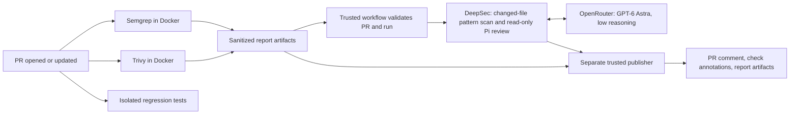

# NodeGoat security pipeline demo

A public fork of [OWASP NodeGoat](https://github.com/OWASP/NodeGoat) demonstrating
pull-request security checks with Semgrep OSS, Trivy OSS, and DeepSec through
OpenRouter. Upstream code is licensed under Apache-2.0; see [LICENSE](LICENSE)
and the [original project documentation](NODEGOAT.md).

**This is an intentionally vulnerable training application. Use synthetic data and
keep any running instance local. No application deployment is needed for scanning.**
The default branch is `master`. It hardens two selected handlers only; it is not a
secure version of NodeGoat and other intentional vulnerabilities remain.

## What the demo shows

| Scenario | Changed file | Expected behavior |
| --- | --- | --- |
| Contribution parsing regression | `app/routes/contributions.js` | Semgrep flags dynamic evaluation; DeepSec investigates whether request input reaches it; the expression-rejection test fails |
| Allocation ownership regression | `app/routes/allocations.js` | DeepSec investigates use of an attacker-selected user ID; the ownership test fails; our five Semgrep rules do not cover this authorization pattern |
| Manual repair | Push the baseline handler back to the same PR | Regression tests recover and security scans run again on the new commit |

Model findings must be reviewed. Tutorial comments and known examples make this a
pipeline demonstration, not an unbiased benchmark of AI discovery. Trivy scans the
full tracked snapshot and can report existing CVEs, synthetic secrets, and Dockerfile
misconfigurations. Baseline findings may remain after the selected regression is fixed.
Counts are scanner observations, not deduplicated unique vulnerabilities.

## Architecture



All jobs use temporary GitHub-hosted Ubuntu runners. The scan and test jobs have
`contents: read`, no model secrets, and no persisted checkout credentials. The
publisher has only the additional permissions to write PR comments/checks. DeepSec
uses trusted default-branch policy and treats the PR snapshot as untrusted data.
It never installs the app, runs it, or changes code. Fork PRs skip credentialed AI.

## Setup for this fork

1. Enable Actions for this fork. The inherited Node 10/12/14 E2E and legacy lint
   workflows have been removed from the active workflow directory. They remain in
   upstream history; this demo does not claim their suites are passing.
2. Configure `security-analysis` with a selected **branch** rule for `master` only.
   Protect `master` and require maintainer review of workflow and security-policy changes.
3. Add **`OPENROUTER_API_KEY`** as an environment secret in `security-analysis`.
   Use a dedicated OpenRouter key with a credit limit. Do not use a general repository
   secret, commit the key, or put it in PR content.
4. Set `SECURITY_DEEPSEC_MODEL=openai/gpt-6-astra`. The adapter uses reasoning `low`
   and supplies the Pi prefix internally. A trusted additional model catalog provides
   Astra metadata for the pinned Pi release.
5. Keep `SECURITY_DEEPSEC_ENABLED=false` for the static pilot, then set it to `true`
   after the environment secret is saved. Push a new commit to a demo PR to run the
   pipeline again. Missing credentials produce an explicit AI skip, not a clean AI review.
6. Use branches inside this fork for the AI demonstration. Open PRs against this
   fork's `master`, never against OWASP upstream. Do not merge the vulnerable branches.

See [complete pipeline setup and local scan commands](.security/README.md),
[scanner responsibilities and architecture](SECURITY-PIPELINE.md), and
[future remediation design](.security/AUTOFIX.md). There is no executable autofix
workflow yet; adding `security-autofix` currently does nothing.

## Run regression tests locally

Use Node 24.18.0:

```sh
node --test .demo/security-regressions.test.cjs
```

These five tests exercise the actual two route handlers with stubbed data access.
They require no npm installation, MongoDB, or real credentials. This is targeted
regression coverage, not the upstream full application test suite. The test harness
uses Node's VM for dependency stubbing; it is not a security sandbox.

To repair either demo PR, check out that PR branch, restore its affected handler from
`origin/master`, run the tests, commit, and push. For the contribution scenario:

```sh
git fetch origin
git restore --source origin/master -- app/routes/contributions.js
node --test .demo/security-regressions.test.cjs
git add app/routes/contributions.js
git commit -m "Fix contribution parsing regression"
git push
```

Check both the latest PR commit and the security comment's referenced commit. The
publisher rejects stale runs. `Security / summary` can remain failed due to NodeGoat's
other intentional findings; use the per-file annotations and artifacts to inspect
the demonstrated change. DeepSec reviews changed files, not every untouched baseline
file. Its review budget is 20 changed files/500 KB and 15 minutes.
