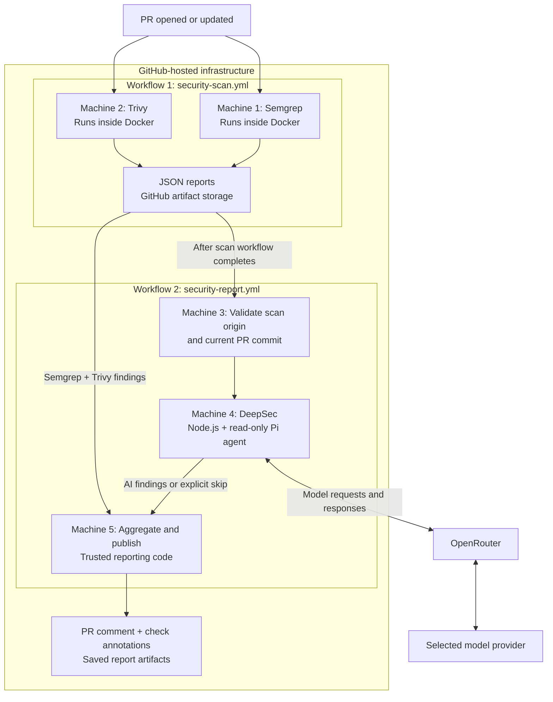

# Pull request security pipeline

A GitHub Actions starter that checks pull requests with **Semgrep Community Edition**,
**Trivy OSS**, and optional **DeepSec AI review**, then publishes findings on the PR.
It never automatically changes application code.

**Status:** implemented and locally tested as a reusable starter; not yet activated
in a target GitHub repository. This workspace had no Git remote, application, or
existing workflows when inspected. Scanner coverage must be tailored to each project.

- [Architecture: what runs where](#architecture-what-runs-where)
- [What each scanner does](#what-each-scanner-does)
- [GitHub Free and costs](#github-free-and-costs)
- [Setup](#setup)
- [Developer results](#developer-results)
- [Local use, remediation, and self-hosted runners](#local-use-remediation-and-self-hosted-runners)

## Architecture: what runs where

**The default architecture uses GitHub-hosted runners. No VPS is required.** The AI
model runs at an external provider, reached through OpenRouter.

- A **workflow** is a YAML file describing when jobs run and what they do.
- A **runner** is the temporary Ubuntu machine executing a job.
- A **Docker container** runs a scanner inside that machine. Here, Docker packages
  Semgrep and Trivy; it does not build or launch the PR's application.

Semgrep and Trivy run in parallel. Once that workflow finishes, a separate workflow
validates its identity and PR commit, optionally runs DeepSec, then combines the results.
Each job gets a fresh runner; the machines are removed afterward. Reports persist in
GitHub artifact storage for seven days. The diagram shows the enabled AI path; forks
and disabled AI produce a skipped report without contacting the model.

The scanning jobs have repository read access. Only the final publishing job can write
PR comments and checks; it cannot commit source changes. That job executes trusted
default-branch reporting scripts and consumes scanner artifacts only as data.

The GitHub environment named `security-analysis` stores the model credential and
restricts which branch can access it. **An environment is an access policy, not a VPS
or another runner.** DeepSec itself executes on GitHub, while model inference happens
externally. This setup does not use Vercel Sandbox or deploy an application to Vercel.

Implementation: [scan workflow](.github/workflows/security-scan.yml),
[report workflow](.github/workflows/security-report.yml), and
[trust boundaries](.security/README.md#trust-boundaries).

## What each scanner does

| Scanner | Primary question | What this starter scans | Credentials |
| --- | --- | --- | --- |
| **Semgrep CE** | Does the code contain known risky patterns or data flows? | Full tracked snapshot, using five local Python/JavaScript/TypeScript rules | None |
| **Trivy OSS** | Are known vulnerable dependencies, exposed secrets, or unsafe infrastructure settings present? | Supported manifests/lockfiles, tracked file contents, IaC, and Dockerfiles | None; downloads public databases |
| **DeepSec** | Does the changed code contain a vulnerability when its surrounding context is considered? | Changed regular files since the PR merge base, with the rest of the snapshot available for reading | Dedicated model API key |

### Semgrep: fast code analysis

Semgrep applies rules to code syntax and, where a rule specifies it, follows data from
a source to a dangerous operation. It does not run the application or call an AI model.

The [checked-in rules](.security/semgrep/rules.yml) currently cover:

1. Python pickle deserialization.
2. Python shell command execution requiring input review.
3. Python unsafe YAML loading.
4. JavaScript/TypeScript dynamic evaluation such as `eval`.
5. Request-like input reaching selected Node.js `child_process` shell calls.

These are a small baseline, not complete SAST coverage. A Java, Go, Ruby, or other
project needs additional reviewed rules. Even Python/JS/TS projects need framework-
specific expansion. A risky call can be legitimate; finding confidence is reported
separately from severity. No paid Semgrep service or remote ruleset is required.

### Trivy: dependencies, secrets, and infrastructure configuration

Trivy matches dependency versions against vulnerability databases, detects potential
secrets in files, and checks supported infrastructure definitions for misconfigurations.
Examples include a dependency version with a published CVE, an apparent API token,
or a Dockerfile configured to run as root.

The adapter uses `trivy filesystem` with `vuln,secret,misconfig` scanners. It does not
install dependencies or build images. **Dockerfile checks are enabled; scanning the OS
packages inside a built container image is not yet implemented.** That would require
a separate `trivy image` step against a trusted image digest. Git history, Git LFS
content, submodule contents, and symlink targets are outside the current snapshot.
Dependencies without supported manifests/lockfiles may not be fully identified.

Trivy's secret values and source snippets are removed from the uploaded report. A
confirmed leaked credential still needs revocation/rotation by its owner.

### DeepSec: contextual AI investigation

DeepSec combines its own pattern matching with an AI coding-agent harness:

1. **`deepsec scan`:** local matching produces candidate locations; no model calls.
2. **`deepsec process`:** an agent investigates files and produces findings with
   severity, confidence, evidence, and recommendations.
3. **`deepsec revalidate`:** an optional later review checks existing findings. This
   starter does not automatically run revalidation or remediation.

For PRs, the official `deepsec process --diff <base>` mode combines scoped matching
and AI review, including changed files with no pattern hits. Our adapter uses the
equivalent `--files-from` interface and computes the list from the PR merge base.
Whole changed files are reviewed, so a finding may concern an existing bug in a touched
file rather than only newly added lines. See [DeepSec's PR mode](https://deepsec.sh/docs/reviewing-changes).

The intended added value is contextual investigation of issues such as authorization
gaps, trust-boundary mistakes, and business-logic vulnerabilities. Results are model
judgments that require review, not guaranteed exploit confirmation. The Pi backend is
restricted to reading within the source snapshot. PR configuration, skills, and agent
instructions are not loaded as trusted policy. Code/context is sent to the selected
model provider; enable this only for repositories approved for that data flow.

### How overlap is handled

Semgrep and DeepSec can identify the same code issue. Trivy can overlap with either on
secrets or configuration. The current reports preserve each scanner's findings and
provenance; they do not deduplicate across tools or feed Semgrep/Trivy findings into
DeepSec. Agreement is useful evidence for investigation, not independent confirmation.

## GitHub Free and costs

Plan availability was checked on **2026-09-09**; review linked policies before deployment.

| Repository and plan | Semgrep + Trivy + reporting | Full setup with protected DeepSec key |
| --- | --- | --- |
| Public repository, GitHub Free | Supported | Supported; model usage is separate |
| Private repository, GitHub Free | Supported within quotas, using the static-only adaptation below | Current environment-based credential design is unavailable |
| Private personal repository, GitHub Pro | Supported within quotas | Supported |
| Private organization repository, GitHub Team | Supported within quotas | Supported |

GitHub Free includes 2,000 monthly Actions minutes for private repositories and 500 MB
of artifact storage shared with GitHub Packages. Minutes belong to the repository
owner's account/organization, not each repository. Parallel jobs consume runner time
individually; a PR update starts another scan. Standard hosted compute for public
repositories is free. [GitHub Actions billing](https://docs.github.com/en/billing/concepts/product-billing/github-actions)

Private repositories need Pro/Team or Enterprise for the environment secrets and
branch restrictions used here. Private-repository branch protection also requires an
eligible paid plan; displaying a failed check and enforcing it before merge are
different capabilities. [Environment availability](https://docs.github.com/en/actions/reference/workflows-and-actions/deployments-and-environments),
[branch protection](https://docs.github.com/en/repositories/configuring-branches-and-merges-in-your-repository/managing-protected-branches/about-protected-branches)

Semgrep and Trivy have no service subscription cost in this setup. DeepSec model calls
are billed separately through OpenRouter; any free credits are for limited usage,
not a guaranteed recurring scan budget. No VPS subscription is required.
[OpenRouter pricing](https://openrouter.ai/pricing)

## Setup

Follow the [complete installation guide](.security/README.md#activate-in-a-repository)
in order. It includes copy commands, GitHub settings, both supported setup paths,
credential provisioning, exact variables, and pilot verification.

1. **Prepare the target repository.** Identify its language/framework and existing
   workflows. Copy the two workflow files and `.security/` directory without generated
   output or dependencies; merge with any existing policy rather than overwriting it.
2. **Choose the setup path.** Use the full profile on public repositories or eligible
   paid private repositories. For private GitHub Free, use the documented
   [static-only job replacement](.security/README.md#path-b-static-only-on-private-github-free).
   Setting the AI flag to false alone does not remove the current job's environment dependency.
3. **Configure GitHub Actions.** Allow the pinned Actions and keep default token
   permissions read-only. The publisher requests only the explicit write permissions
   needed for PR comments/checks. Leave runner variables unset to use GitHub-hosted Ubuntu.
4. **For full AI review, configure `security-analysis`.** Allow only the protected
   default branch; store `OPENROUTER_API_KEY` there as an environment secret. Set
   repository variables `SECURITY_DEEPSEC_MODEL` and `SECURITY_DEEPSEC_ENABLED=true`.
   Do not put the key in general repository secrets to bypass environment restrictions.
5. **Merge policy into the default branch first.** Protect workflow/security policy
   changes with maintainer review where your plan supports enforcement. The first PR
   introducing this starter cannot exercise the complete trusted reporting flow.
6. **Open a pilot PR and then update it.** Check the scan jobs, report artifacts, PR
   summary, AI status, and current-commit annotations. Test fork handling and failure
   cases before selecting required checks. No production credential is needed.

## Developer results

The pipeline updates one PR comment and creates a `Security / summary` check. Findings
are grouped into high-severity/high-confidence code vulnerabilities, other code
findings, dependency/CVE findings, secrets, IaC/container misconfigurations, and
informational findings. Up to 50 check annotations are displayed; normalized JSON
artifacts contain all retained findings and are stored for seven days.

The current policy fails the aggregate check for potential secrets, HIGH/CRITICAL code
findings with high confidence, or failed/missing/partial scanner coverage. Dependencies,
misconfigurations, and other code findings are advisory. Skipped DeepSec gives a neutral
summary when no failing condition is present; neutral does not mean AI review completed.
See [finding policy and artifacts](.security/README.md#findings-and-developer-experience).

## Local use, remediation, and self-hosted runners

- [Local commands](.security/README.md#run-locally): run from a trusted policy checkout
  with Python 3, Git, Docker, and Node for DeepSec. These commands analyze committed HEAD.
- [Troubleshooting](.security/README.md#troubleshooting): missing reports, skipped AI,
  permissions, quotas, and incomplete coverage.
- [Remediation design](.security/AUTOFIX.md): a separate future workflow will require
  explicit maintainer authorization for an exact PR commit. `security-autofix` currently
  has no effect; there is no enabled code-writing agent.
- [Self-hosted runner migration](.security/README.md#maintenance-and-later-runners): later
  replace heavy job runners with isolated, disposable workers through runner variables.
  Keep validation/publishing on GitHub-hosted runners. A persistent VPS with production
  credentials or network access is not suitable for untrusted PR workloads.
- [Validation status](.security/README.md#validation-performed-here): local tests passed;
  live GitHub publishing, protected-environment behavior, Linux container execution,
  and paid model calls still need verification in the target repository.
